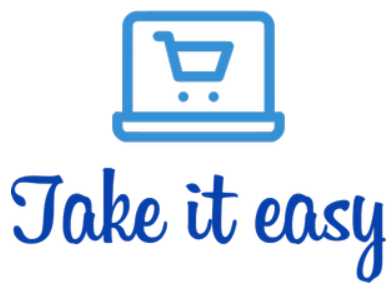
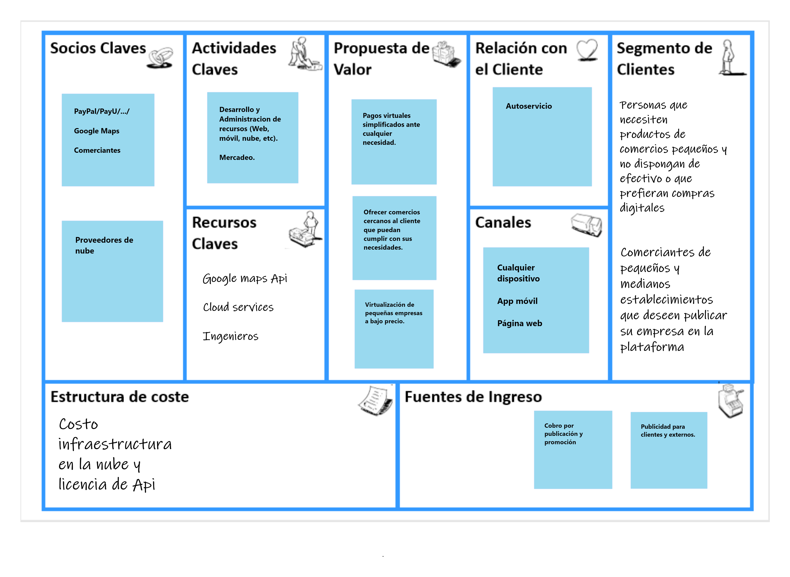

# Take it easy

Take it easy es una aplicación que conecta a los tenderos de barrio con los compradores cercanos,
ofreciendo la oportunidad de digitalizar el negocio, darse a conocer entre los usuarios cercanos, 
ofrecer la posibilidad del pago digital y permitir que los usuarios puedan hacer sus pedidos de forma remota 
para recogerlos en un futuro, de modo que se puede ofrecer un mejor servicio al reducir el tiempo que necesita
el usuario para obtener y pagar sus productos. El objetivo de Take it easy es potenciar a los tenderos, dandoles una 
presencia digital a un bajo costo.
## Equipo

- Juan Rojas
- Andres Marcelo
- Johan Arias
- Johann Paez
- Jeisson Sanchez

## Modelo de negocio

## Arquitectura propuesta

### Badges

